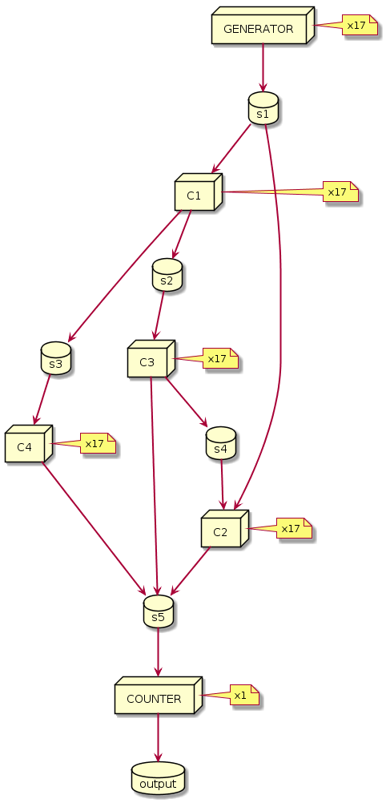

nuxeo-mqueues-core
===========================

## About

This module implements a generic message queue (MQueues) used to implement different producer/consumer patterns.

## Warning

This module is under development and still experimental, interfaces and implementations may change until it is announced as a stable module.

## MQueues features

A MQueues (Multiple Queues) is a bounded array of queues, each queue is referenced by an index.

A producer is responsible for choosing which message to assign to which queue:

* Using a round robin algorithm a producer can balance messages between queues.
* Producer can also use a shard key to group message by queue following its own semantic.

Each queue is an ordered immutable sequence of messages that are appended:

* The producer will never be blocked when appending a message.

Consumers read messages from a queue using a tailer, the current read position (aka offset) can be persisted.

* Consumer don't destroy messages while reading from a queue.
* Consumer can stop and restart without losing its place by choosing the last persisted offset.
* Consumer can also choose to read message from the beginning or end of a queue.

Consumers can choose a namespace to persist its offset:

* Each consumer for a queue see the same messages in the same order
* There is only one tailer per queue in a namespace to prevent conflict in commit.

This is enough to implement two main patterns of producer/consumer:

1. Queuing (aka work queue): a message is delivered to one and only one consumer
  * producers dispatch messages in queues
  * there is a single consumer per queue: the number of consumers is equal to the number of queues
2. Pub/Sub (aka event bus): an event is publish on a channel, multiple listeners can subscribe to a channel
  * a publisher append messages to a queue (channel)
  * subscribers read messages from a queue, each subscriber has its own offset namespace

## Default MQueues implementation

The default queues implementation is using [Chronicle Queues](https://github.com/OpenHFT/Chronicle-Queue) which is an Off-Heap implementation.

A MQueues of size N will creates N Chronicle Queues, one for each queue.
There is an additional Chronicle Queue created for each consumer offset namespace.

The only limitation is the available disk storage, there is no retention policy so everything is kept for ever.

That being said Chronicle Queue by default creates a single file per queue and per day, so it is possible to script some retention policy like keeping messages for the last D days.
(It is also possible to change the cycle to create a file every hours).

## Patterns

### Pattern 1: Queuing with a limited amount of messages

Typical usage can be a mass import process where producers extract documents and consumer import documents:

* it decouples producers and consumers: import process can be run multiple time in a deterministic way for debugging and tuning.
* it brings concurrency in import when producer dispatch messages with a correct semantic and evenly.

For efficiency consumer process message per batch. For reliability consumer follow a retry policy.

This is a one time process:

* Producers end on error or when all message are sent.
* Consumers stop in error (according to the retry policy) or when all messages are processed.

The proposed solution takes care of:

* Driving producers/consumers thread pools
* Following a [consumer policy](https://github.com/nuxeo/nuxeo-mqueues/blob/master/nuxeo-mqueues-core/src/main/java/org/nuxeo/ecm/platform/importer/mqueues/consumer/ConsumerPolicy.java) that defines:
    - the batch policy: capacity and timeout
    - the retry policy: which exceptions to catch, number of retry, backoff and much more see [failsafe](https://github.com/jhalterman/failsafe) library for more info
    - when to stop and what to do in case of failure
* Saving the consumer's offset when a batch of messages is successfully processed
* Starting consumers from the last successfully processed message
* Exposing metrics for producers and consumers

To use this pattern one must implement a [ProducerIterator](https://github.com/nuxeo/nuxeo-mqueues/blob/master/nuxeo-mqueues-core/src/main/java/org/nuxeo/ecm/platform/importer/mqueues/producer/ProducerIterator.java) and a [Consumer](https://github.com/nuxeo/nuxeo-mqueues/blob/master/nuxeo-mqueues-core/src/main/java/org/nuxeo/ecm/platform/importer/mqueues/consumer/Consumer.java) with factories.
Both the producer and consumer implementation are driven (pulled) by the module.

See [TestBoundedQueuingPattern](https://github.com/nuxeo/nuxeo-mqueues/blob/master/nuxeo-mqueues-core/src/test/java/org/nuxeo/ecm/platform/importer/mqueues/tests/TestBoundedQueuingPattern.java) for basic examples.

### Pattern 2: Queuing unlimited

Almost the same as pattern as above but producers and consumers are always up processing an infinite flow of messages.
There is no Producer interface, a producer just use a [MQueues](https://github.com/nuxeo/nuxeo-mqueues/blob/master/nuxeo-mqueues-core/src/main/java/org/nuxeo/ecm/platform/importer/mqueues/mqueues/MQueues.java) to append messages.

The Consumer is driven the same way but its policy is different:

* a consumer will wait forever on new message
* after a failure on the retry policy, the consumer will continue and take the next message
* consumer can be stopped properly using a poison pill message

A producer can wait for a message to be consumed, this can simulate an async call.

See [TestQueuingPattern](https://github.com/nuxeo/nuxeo-mqueues/blob/master/nuxeo-mqueues-core/src/test/java/org/nuxeo/ecm/platform/importer/mqueues/tests/TestQueuingPattern.java) for basic examples.

### Pattern 3: Publish subscribe (Event bus)

Publishing is done by appending message to mqueues.

Multiple Consumers using different offset namespace can tail on the mqueues.

### Pattern 4: Stream and Computations
 
This pattern is taken from [Google MillWheel](https://research.google.com/pubs/pub41378.html) and is implemented in [Concord.io](http://concord.io/docs/guides/architecture.html
) or [Kafka Stream Processor](https://github.com/apache/kafka/blob/trunk/streams/src/main/java/org/apache/kafka/streams/processor/Processor.java).

Instead of message we have record that hold some specific fields like the key and a watermark in addition to the payload.

The key is used to route the record. Records with the same key are always routed to the same computation instance.

The computation is defined almost like in [concord][http://concord.io/docs/guides/concepts.html].
 
The Topology represent a DAG of computations, that can be executed using a ComputationManager.
Computation read from 0 to n streams and write from 0 to n streams.

Here is an example of the DAG used in UT:

  
  
TODO: more 

## Building

To build and run the tests, simply start the Maven build:

    mvn clean install

### Following Project QA Status

## About Nuxeo
Nuxeo dramatically improves how content-based applications are built, managed and deployed, making customers more agile, innovative and successful. Nuxeo provides a next generation, enterprise ready platform for building traditional and cutting-edge content oriented applications. Combining a powerful application development environment with SaaS-based tools and a modular architecture, the Nuxeo Platform and Products provide clear business value to some of the most recognizable brands including Verizon, Electronic Arts, Sharp, FICO, the U.S. Navy, and Boeing. Nuxeo is headquartered in New York and Paris. More information is available at www.nuxeo.com.
